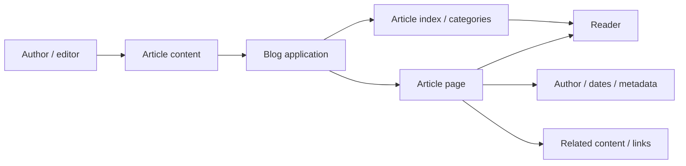
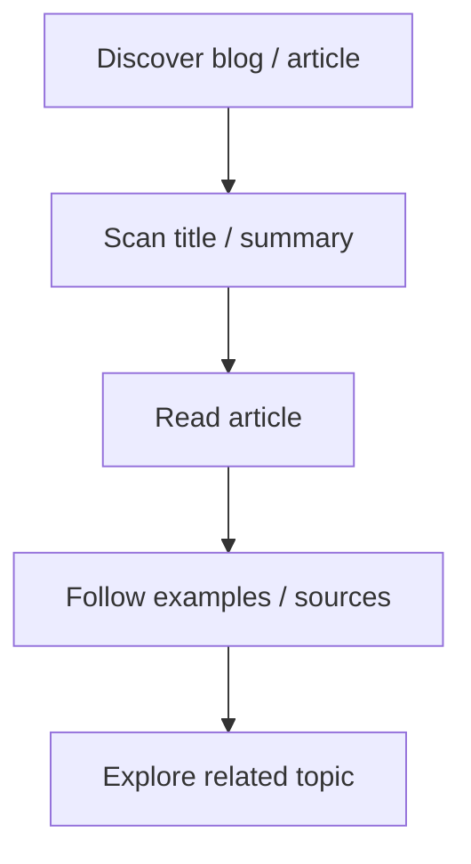
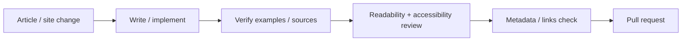

<div align="center">

# Tech Blog

**A technology-blog project for publishing clear technical articles, tutorials, notes, and topic-focused content through a readable web experience.**


[Browse source](https://github.com/Nischhalsubba/Tech_Blog/tree/main) · [Issues](https://github.com/Nischhalsubba/Tech_Blog/issues)

</div>

## Overview

**Tech Blog** is documented around the reader journey: discover a useful topic, scan enough context to judge relevance, read the article comfortably, follow references, and continue to related material without the page behaving like an advertising obstacle course.

<details open>
<summary><strong>🏗️ Interactive blog architecture</strong></summary>



</details>

## Reader flow



## Audience guide

| Audience | Focus |
|---|---|
| Readers | Clear, trustworthy technical content |
| Developers | Routing, content rendering, code blocks and deployment |
| Designers | Long-form readability, navigation and responsive typography |
| Editors | Accuracy, structure, links, dates, metadata and revisions |

## Getting started

```bash
git clone https://github.com/Nischhalsubba/Tech_Blog.git
cd Tech_Blog
```

Use the committed manifests and lockfiles to determine the current runtime and development commands.

## Editorial & accessibility principles

Prefer descriptive headings, concise intros, syntax-highlighted code with surrounding explanation, useful link text, image alternatives, readable line lengths, visible focus, responsive typography and accurate publication/update context.

## SEO & discoverability

For each article, maintain a unique title and meta description, stable slug, canonical URL, semantic heading hierarchy, useful internal links, author and publication/update dates, Open Graph metadata, Article structured data, sitemap inclusion and meaningful alt text. Technical keywords should occur because the article actually explains them, not because search engines were invited to a word salad.

## Contribution flow


