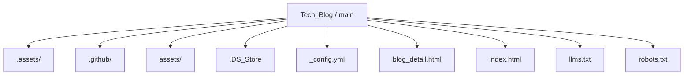
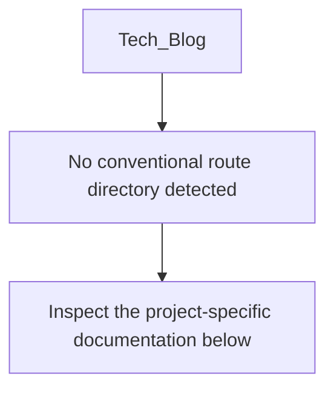
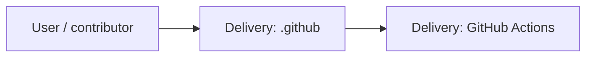
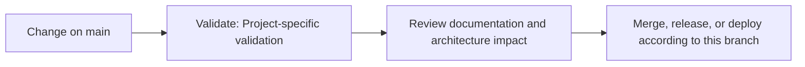

<div align="center">

# 📰 Tech_Blog

<!-- interactive-readme-standard:start -->

> [!NOTE]
> **Branch-specific documentation:** this section is maintained for [`main`](https://github.com/Nischhalsubba/Tech_Blog/tree/main). It is generated from the files present on this branch and preserves the project-authored README below.

<details open>
<summary><strong>Interactive repository guide</strong></summary>

## Branch overview

| Item | Value |
|---|---|
| Repository | [`Nischhalsubba/Tech_Blog`](https://github.com/Nischhalsubba/Tech_Blog) |
| Branch | [`main`](https://github.com/Nischhalsubba/Tech_Blog/tree/main) |
| Detected stack | Sass, CSS, JavaScript, HTML |
| Detected manifests | No standard manifest detected |
| Documentation policy | Every maintained branch must explain purpose, setup, structure, architecture, flows, testing, delivery, security, and ownership. |

## Repository structure



The diagram is generated from the branch's actual top-level files and directories. Use the branch link above for complete source navigation.

## Website or application structure



## Application and responsibility flow



## Change-to-delivery flow



## README requirements for this branch

- Explain what this branch contains and how it differs from the default branch.
- Keep installation, configuration, usage, testing, deployment, security, support, and license information accurate.
- Document repository, website or application, API, data, authentication, background-job, and deployment flows when they exist.
- Prefer Mermaid diagrams and expandable `<details>` sections for visual navigation.
- Link diagrams and modules to real source paths; never invent missing components.
- Preserve project-specific documentation and update diagrams whenever architecture or major paths change.
- Treat secrets, private infrastructure, customer data, and credentials as prohibited README content.

</details>

<!-- interactive-readme-standard:end -->

### ESR Tech Blog Listing Page

**A static blog-grid website page for ESR Tech, built with HTML, CSS, JavaScript, jQuery, plugin scripts, responsive layout patterns, search UI, article cards, pagination, and a structured footer/newsletter section.**


</div>

---

## ✨ Overview

**Tech_Blog** is a static blog listing page designed for the ESR Tech website. It presents a blog index with a hero section, search bar, article cards, categories, dates, summaries, pagination, navigation menu, and footer newsletter area.

The page is built as a classic static HTML/CSS/JavaScript website. It uses local assets, jQuery, plugin scripts, Font Awesome, Google Fonts, and responsive grid classes to create a professional technology-company blog experience.

---

## 🧭 Table of Contents

- [Project Purpose](#-project-purpose)
- [Designer’s Perspective](#-designers-perspective)
- [Page Structure](#-page-structure)
- [Features](#-features)
- [Tech Stack](#-tech-stack)
- [Content Model](#-content-model)
- [Repository Structure](#-repository-structure)
- [Run Locally](#-run-locally)
- [Deployment](#-deployment)
- [Design QA Checklist](#-design-qa-checklist)
- [Technical QA Checklist](#-technical-qa-checklist)
- [Roadmap](#-roadmap)

---

## 🎯 Project Purpose

The purpose of this repository is to create a static blog page for a technology company website.

The page helps visitors:

- browse technology and cybersecurity-related articles
- scan article cards quickly
- search for blog content
- navigate company/service pages
- move into article detail pages
- subscribe through the newsletter footer

---

## 🎨 Designer’s Perspective

This page follows a traditional corporate blog layout, but the design still needs to feel polished and readable.

The important UX goals are:

- clear blog title and supporting copy
- visible search UI in the hero section
- article cards with strong image/title/category hierarchy
- readable excerpts
- consistent card spacing
- clear pagination
- footer links that support discovery
- responsive behavior across desktop and mobile

For a tech company blog, trust and readability matter more than decorative complexity.

---

## 🧱 Page Structure

| Section | Purpose |
|---|---|
| Header / Navigation | Company logo, dropdown navigation, services/portfolio/contact links |
| Hero / Page Title | Blog title, introductory text, and search input |
| Blog Grid | Six article preview cards with images, categories, dates, and excerpts |
| Pagination | Multi-page blog navigation UI |
| Footer | Company links, solutions, resources, newsletter signup, copyright |
| Scroll Top Button | Quick return-to-top interaction |

---

## 🌟 Features

| Feature | Description |
|---|---|
| Static blog grid | Card-based list of blog posts |
| Hero search UI | Search field and button in the page-title area |
| Dropdown navigation | Company dropdown menu in the header |
| Article metadata | Category and date displayed on each card |
| Read More actions | Links from cards to blog detail pages |
| Pagination | Numeric pagination pattern |
| Newsletter section | Email input and privacy checkbox in footer |
| Scroll-to-top | Footer button for returning to page top |
| External imagery | Mix of local assets and remote image URLs |

---

## 🛠 Tech Stack

| Layer | Technology | Purpose |
|---|---|---|
| Markup | HTML5 | Page structure |
| Styling | CSS | Layout and visual design |
| JavaScript | jQuery + plugins | Navigation, scroll, and UI behavior |
| Fonts | Barlow + Roboto | Corporate technology typography |
| Icons | Font Awesome / icon fonts | UI icons and navigation symbols |
| Assets | Local `assets/` folder | Logos, CSS, JS, favicon, images |

---

## 📝 Content Model

Each blog card includes:

- thumbnail image
- category links
- publication date
- article title
- excerpt/description
- read-more CTA

Current visible article themes include:

- national security and software vulnerability
- traveltech centre of excellence
- cyber resilient enterprises
- child online safety
- organizational culture
- holiday/company updates

---

## 📁 Repository Structure

```text
.
├── index.html
├── blog_detail.html
├── assets/
│   ├── css/
│   │   ├── libraries.css
│   │   └── style.css
│   ├── js/
│   │   ├── jquery-3.5.1.min.js
│   │   ├── plugins.js
│   │   └── main.js
│   └── images/
│       ├── favicon/
│       ├── logo/
│       └── blog/
└── README.md
```

---

## 🚀 Run Locally

Because this is a static site, no build step is required.

### Option 1: Open directly

Open `index.html` in your browser.

### Option 2: Run a local server

```bash
python -m http.server 8000
```

Then open:

```text
http://127.0.0.1:8000/
```

---

## 🌐 Deployment

This project can be deployed to any static hosting service:

- GitHub Pages
- Netlify
- Vercel
- Cloudflare Pages
- shared hosting / cPanel

Upload the project files with the same folder structure so asset paths continue to work.

---

## ✅ Design QA Checklist

- [ ] Blog hero is readable over background image.
- [ ] Search bar is visually clear.
- [ ] Article cards have consistent image height.
- [ ] Category/date/title hierarchy is clear.
- [ ] Footer links are grouped logically.
- [ ] Mobile layout stacks cleanly.
- [ ] Pagination is easy to tap on mobile.

---

## 🧪 Technical QA Checklist

- [ ] `index.html` loads without broken CSS/JS.
- [ ] Logo assets load correctly.
- [ ] Blog images load correctly.
- [ ] Dropdown navigation works.
- [ ] Scroll-to-top button works.
- [ ] Blog detail links point to valid pages.
- [ ] Search UI does not imply functionality unless connected.
- [ ] External image URLs are stable or replaced locally.

---

## 🗺 Roadmap

- Add real search functionality.
- Add individual blog detail pages for every article.
- Add SEO metadata for each page.
- Add Open Graph images.
- Replace remote images with optimized local assets.
- Add sitemap and robots file.
- Improve accessibility labels for search/newsletter forms.
- Connect newsletter form to a backend or form service.

---

<div align="center">

Built as a static technology-company blog listing page with a clear editorial grid.

</div>
