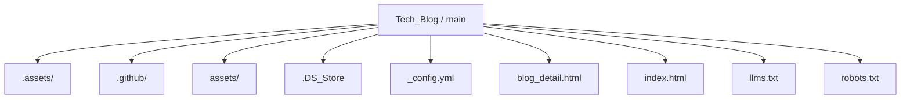
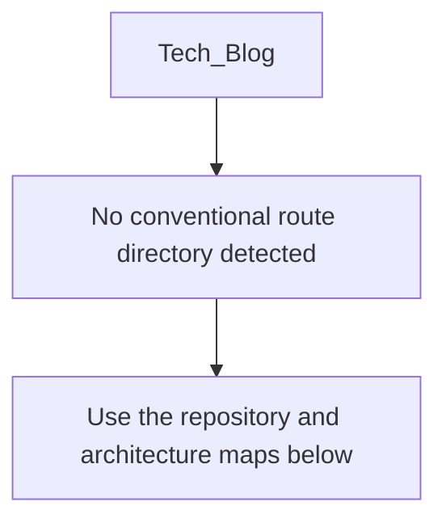
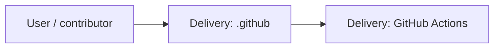
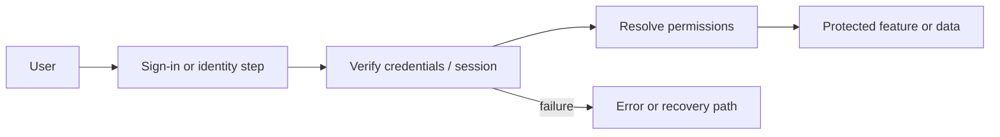
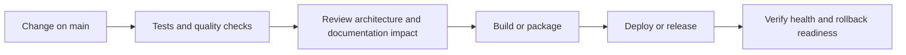
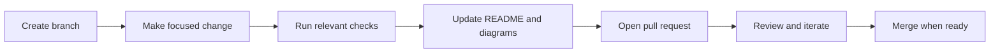

<!-- interactive-readme-standard:start -->

<div align="center">

# Tech_Blog

**Branch-aware technical guide for [`main`](https://github.com/Nischhalsubba/Tech_Blog/tree/main)**

<p>     </p>

<p>
  <a href="https://github.com/Nischhalsubba/Tech_Blog/tree/main"><strong>Browse source</strong></a> ·
  <a href="https://github.com/Nischhalsubba/Tech_Blog/issues"><strong>Issues</strong></a> ·
  <a href="https://github.com/Nischhalsubba/Tech_Blog/codespaces/new?ref=main"><strong>Open in Codespaces</strong></a>
</p>

</div>

> [!IMPORTANT]
> This guide is generated from the files actually present on `main`. It links to detected source paths, preserves project-authored notes, and avoids claiming components that were not found.

## At a glance

| Item | Detected value |
|---|---|
| Purpose | A Sass project documented from the current branch structure and manifests. |
| Branch role | Default branch |
| Stack | Sass, CSS, JavaScript, HTML |
| Manifests | No standard manifest detected |
| Prerequisites | Confirm from the detected manifests |
| Delivery | GitHub Actions |
| License | No license file detected |

## Branch scope

This is the repository's default branch.


## Quick start

> No reliable setup command was detected. Use the preserved project-authored notes and manifests rather than guessing.

### Configuration surface

- No committed environment example file was detected.

> Never commit secrets, private keys, production credentials, customer data, or unredacted infrastructure details.

## Repository map



| Responsibility | Detected source paths |
|---|---|
| Delivery | [`.github`](https://github.com/Nischhalsubba/Tech_Blog/tree/main/.github) |

## Website or application map



## Architecture and responsibility flow



<details>
<summary><strong>Authentication and authorization flow</strong></summary>



Relevant detected files: [`assets/images/blog/author/2.jpg`](https://github.com/Nischhalsubba/Tech_Blog/blob/main/assets/images/blog/author/2.jpg), [`assets/images/blog/author/4.png`](https://github.com/Nischhalsubba/Tech_Blog/blob/main/assets/images/blog/author/4.png), [`assets/images/blog/author/3.jpg`](https://github.com/Nischhalsubba/Tech_Blog/blob/main/assets/images/blog/author/3.jpg), [`assets/images/blog/author/1.jpg`](https://github.com/Nischhalsubba/Tech_Blog/blob/main/assets/images/blog/author/1.jpg).

> The diagram expresses the responsibility sequence only. Confirm exact providers, token formats, roles, and recovery behavior in the linked source.

</details>

## Quality, security, and operations

<table>
<tr>
<td width="33%" valign="top">

### Quality

- No conventional test directory was detected automatically.

Detected commands:
- No standard quality command detected.

</td>
<td width="33%" valign="top">

### Security

- No dedicated security policy or automated dependency configuration was detected.

Review authentication, authorization, input validation, dependency updates, secret handling, and failure recovery before release.

</td>
<td width="34%" valign="top">

### Observability

- No dedicated observability integration was detected automatically.

Define useful logs, metrics, traces, alerts, and rollback signals for production-facing branches.

</td>
</tr>
</table>

## Delivery flow



### Automation detected

- [`.github/workflows/apply-interactive-readme.yml`](https://github.com/Nischhalsubba/Tech_Blog/blob/main/.github/workflows/apply-interactive-readme.yml)

## Contribution flow



- Keep changes focused and explain architectural consequences.
- Run the checks relevant to the changed area.
- Update diagrams whenever routes, modules, data models, authentication, jobs, or delivery paths change.
- Add screenshots or recordings for visual behavior changes when useful.
- Use issues for reproducible defects and pull requests for reviewable changes.

## Ownership and support

| Topic | Source |
|---|---|
| Repository | [`Nischhalsubba/Tech_Blog`](https://github.com/Nischhalsubba/Tech_Blog) |
| Branch | [`main`](https://github.com/Nischhalsubba/Tech_Blog/tree/main) |
| Ownership | No CODEOWNERS file detected |
| Contributing | Use the contribution flow above |
| Support | [Open or review issues](https://github.com/Nischhalsubba/Tech_Blog/issues) |
| License | No license file detected |

<details>
<summary><strong>Documentation maintenance checklist</strong></summary>

- [ ] Purpose and branch scope are accurate.
- [ ] Setup and configuration commands still work.
- [ ] Repository, application, API, data, authentication, job, and deployment diagrams match the code.
- [ ] Tests, security controls, observability, and rollback behavior are documented.
- [ ] Links point to real files on this branch.
- [ ] No secrets or private operational details are exposed.

</details>

<!-- interactive-readme-standard:end -->

<!-- project-authored-notes:start -->
<details>
<summary><strong>Project-authored notes preserved from this branch</strong></summary>

<div align="center">

# 📰 Tech_Blog

### ESR Tech Blog Listing Page

**A static blog-grid website page for ESR Tech, built with HTML, CSS, JavaScript, jQuery, plugin scripts, responsive layout patterns, search UI, article cards, pagination, and a structured footer/newsletter section.**


</div>

---

## ✨ Overview

**Tech_Blog** is a static blog listing page designed for the ESR Tech website. It presents a blog index with a hero section, search bar, article cards, categories, dates, summaries, pagination, navigation menu, and footer newsletter area.

The page is built as a classic static HTML/CSS/JavaScript website. It uses local assets, jQuery, plugin scripts, Font Awesome, Google Fonts, and responsive grid classes to create a professional technology-company blog experience.

---

## 🧭 Table of Contents

- [Project Purpose](#-project-purpose)
- [Designer’s Perspective](#-designers-perspective)
- [Page Structure](#-page-structure)
- [Features](#-features)
- [Tech Stack](#-tech-stack)
- [Content Model](#-content-model)
- [Repository Structure](#-repository-structure)
- [Run Locally](#-run-locally)
- [Deployment](#-deployment)
- [Design QA Checklist](#-design-qa-checklist)
- [Technical QA Checklist](#-technical-qa-checklist)
- [Roadmap](#-roadmap)

---

## 🎯 Project Purpose

The purpose of this repository is to create a static blog page for a technology company website.

The page helps visitors:

- browse technology and cybersecurity-related articles
- scan article cards quickly
- search for blog content
- navigate company/service pages
- move into article detail pages
- subscribe through the newsletter footer

---

## 🎨 Designer’s Perspective

This page follows a traditional corporate blog layout, but the design still needs to feel polished and readable.

The important UX goals are:

- clear blog title and supporting copy
- visible search UI in the hero section
- article cards with strong image/title/category hierarchy
- readable excerpts
- consistent card spacing
- clear pagination
- footer links that support discovery
- responsive behavior across desktop and mobile

For a tech company blog, trust and readability matter more than decorative complexity.

---

## 🧱 Page Structure

| Section | Purpose |
|---|---|
| Header / Navigation | Company logo, dropdown navigation, services/portfolio/contact links |
| Hero / Page Title | Blog title, introductory text, and search input |
| Blog Grid | Six article preview cards with images, categories, dates, and excerpts |
| Pagination | Multi-page blog navigation UI |
| Footer | Company links, solutions, resources, newsletter signup, copyright |
| Scroll Top Button | Quick return-to-top interaction |

---

## 🌟 Features

| Feature | Description |
|---|---|
| Static blog grid | Card-based list of blog posts |
| Hero search UI | Search field and button in the page-title area |
| Dropdown navigation | Company dropdown menu in the header |
| Article metadata | Category and date displayed on each card |
| Read More actions | Links from cards to blog detail pages |
| Pagination | Numeric pagination pattern |
| Newsletter section | Email input and privacy checkbox in footer |
| Scroll-to-top | Footer button for returning to page top |
| External imagery | Mix of local assets and remote image URLs |

---

## 🛠 Tech Stack

| Layer | Technology | Purpose |
|---|---|---|
| Markup | HTML5 | Page structure |
| Styling | CSS | Layout and visual design |
| JavaScript | jQuery + plugins | Navigation, scroll, and UI behavior |
| Fonts | Barlow + Roboto | Corporate technology typography |
| Icons | Font Awesome / icon fonts | UI icons and navigation symbols |
| Assets | Local `assets/` folder | Logos, CSS, JS, favicon, images |

---

## 📝 Content Model

Each blog card includes:

- thumbnail image
- category links
- publication date
- article title
- excerpt/description
- read-more CTA

Current visible article themes include:

- national security and software vulnerability
- traveltech centre of excellence
- cyber resilient enterprises
- child online safety
- organizational culture
- holiday/company updates

---

## 📁 Repository Structure

```text
.
├── index.html
├── blog_detail.html
├── assets/
│   ├── css/
│   │   ├── libraries.css
│   │   └── style.css
│   ├── js/
│   │   ├── jquery-3.5.1.min.js
│   │   ├── plugins.js
│   │   └── main.js
│   └── images/
│       ├── favicon/
│       ├── logo/
│       └── blog/
└── README.md
```

---

## 🚀 Run Locally

Because this is a static site, no build step is required.

### Option 1: Open directly

Open `index.html` in your browser.

### Option 2: Run a local server

```bash
python -m http.server 8000
```

Then open:

```text
http://127.0.0.1:8000/
```

---

## 🌐 Deployment

This project can be deployed to any static hosting service:

- GitHub Pages
- Netlify
- Vercel
- Cloudflare Pages
- shared hosting / cPanel

Upload the project files with the same folder structure so asset paths continue to work.

---

## ✅ Design QA Checklist

- [ ] Blog hero is readable over background image.
- [ ] Search bar is visually clear.
- [ ] Article cards have consistent image height.
- [ ] Category/date/title hierarchy is clear.
- [ ] Footer links are grouped logically.
- [ ] Mobile layout stacks cleanly.
- [ ] Pagination is easy to tap on mobile.

---

## 🧪 Technical QA Checklist

- [ ] `index.html` loads without broken CSS/JS.
- [ ] Logo assets load correctly.
- [ ] Blog images load correctly.
- [ ] Dropdown navigation works.
- [ ] Scroll-to-top button works.
- [ ] Blog detail links point to valid pages.
- [ ] Search UI does not imply functionality unless connected.
- [ ] External image URLs are stable or replaced locally.

---

## 🗺 Roadmap

- Add real search functionality.
- Add individual blog detail pages for every article.
- Add SEO metadata for each page.
- Add Open Graph images.
- Replace remote images with optimized local assets.
- Add sitemap and robots file.
- Improve accessibility labels for search/newsletter forms.
- Connect newsletter form to a backend or form service.

---

<div align="center">

Built as a static technology-company blog listing page with a clear editorial grid.

</div>

</details>
<!-- project-authored-notes:end -->
